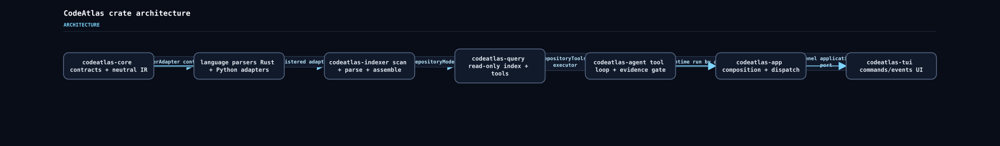
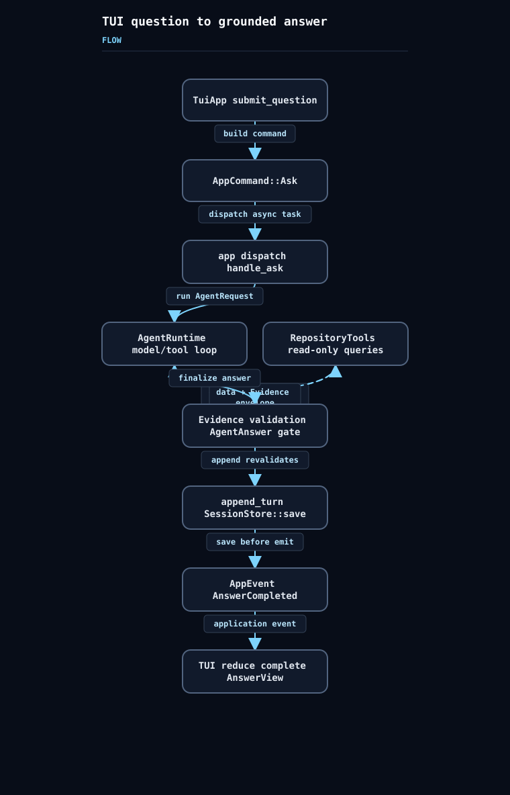
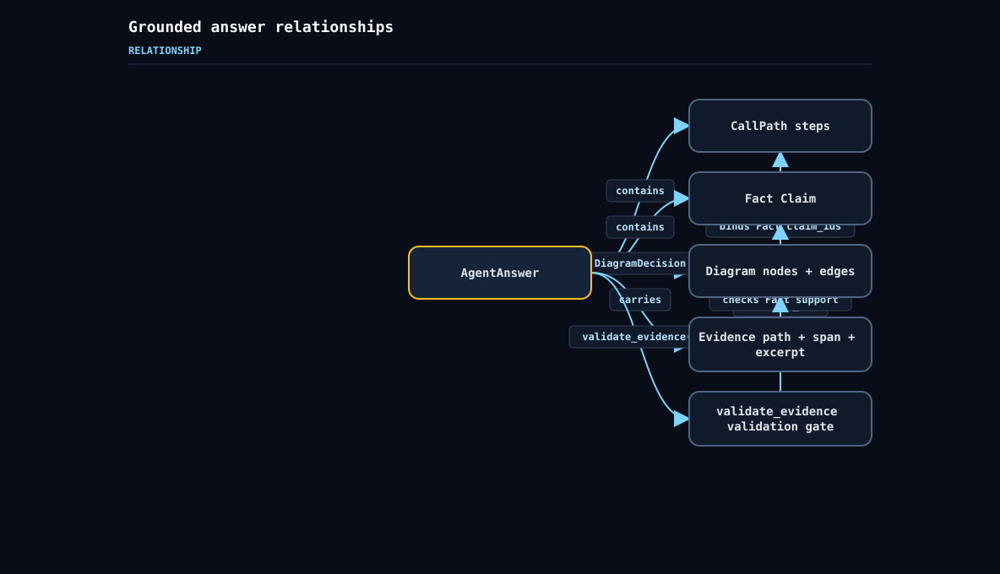

# CodeAtlas Diagram Showcase

此目录由 `codeatlas_showcase` example 离线、确定性生成；不调用模型、外部绘图工具或应用 artifact store。

## 1. `architecture`

### 问题

> CodeAtlas 的核心 crate 如何分工并组合？

### 回答

**职责**

- codeatlas-core 提供跨组件共享的语言无关契约；解析器、模型客户端、存储后端和 UI 位于该 crate 之外。 [E1]
- codeatlas-indexer 消费 core 的 ParseInput 与 RepositoryModel 契约，负责仓库扫描、解析分派和语言无关索引组装。 [E2] [E3]
- Rust 与 Python language crates 都实现 core::ParserAdapter，并把 tree-sitter 解析结果转换为 ParsedFile。 [E4] [E5]
- codeatlas-query 在 RepositoryModel 上构造确定性的只读 RepositoryIndex，并通过 RepositoryTools 实现 ToolExecutor。 [E6] [E7]
- codeatlas-agent 使用 core 的 answer、event 与 tool 契约，提供 UI 无关的只读工具循环、证据门禁和会话服务。 [E8] [E9] [E10]
- codeatlas-app 直接组合 agent、core、diagram、indexer、Rust/Python parsers、query 与 tui，并承担后台命令分发。 [E11] [E12]
- codeatlas-tui 只接收 AppEvent 并发出 AppCommand；它不检查仓库、不执行工具，也不调用模型。 [E13]

**依赖与组合**

- 应用组合层把 RustParser 与 PythonParser 注册到 ParserRegistry，再交给 Indexer。 [E14]
- 索引完成后，应用用 IndexReport.model 构造 RepositoryIndex，并封装为 RepositoryTools。 [E15]
- 处理 Ask 时，应用把 RepositoryTools 及其 definitions 作为 AgentRuntime 的 executor 和工具清单。 [E16]
- 二进制把 application channels 适配为 ChannelApplicationPort，再以同一个 TuiApp 运行终端循环。 [E17] [E18]

### 图

- 图类型：`architecture`
- 选择理由：多个 crate 的职责、共享契约和组合依赖同时存在，architecture 图能减少边界歧义。

### Evidence

- **E1** `crates/codeatlas-core/src/lib.rs:1-4` - `` //! Parser implementations, model clients, storage backends, and user ``
- **E2** `crates/codeatlas-indexer/src/lib.rs:1-16` - `` //! Safe repository scanning and language-neutral index assembly. ``
- **E3** `crates/codeatlas-indexer/src/indexer.rs:148-217` - `` match self.parsers.parse( ``
- **E4** `crates/codeatlas-lang-rust/src/lib.rs:24-70` - `` impl ParserAdapter for RustParser { ``
- **E5** `crates/codeatlas-lang-python/src/lib.rs:35-85` - `` impl ParserAdapter for PythonParser { ``
- **E6** `crates/codeatlas-query/src/index.rs:49-114` - `` /// A deterministic, read-only in-memory index over one repository model. ``
- **E7** `crates/codeatlas-query/src/tools.rs:22-99` - `` impl ToolExecutor for RepositoryTools { ``
- **E8** `crates/codeatlas-agent/src/lib.rs:1-20` - `` //! UI-independent model, agent runtime, evidence, and session services. ``
- **E9** `crates/codeatlas-agent/src/runtime.rs:8-13` - `` AgentAnswer, AnswerId, AppError, AppEvent, CallPath, CallPathId, Claim, ClaimId, ClaimKind, ``
- **E10** `crates/codeatlas-agent/src/runtime.rs:176-183` - `` /// Question-driven, read-only tool loop with hard resource and evidence gates. ``
- **E11** `crates/codeatlas-app/Cargo.toml:12-25` - `` codeatlas-agent = { path = "../codeatlas-agent" } ``
- **E12** `crates/codeatlas-app/src/lib.rs:1-2` - `` //! Application composition and background command dispatch for `CodeAtlas`. ``
- **E13** `crates/codeatlas-tui/src/lib.rs:1-5` - `` //! execute tools, call models, or retain credentials. ``
- **E14** `crates/codeatlas-app/src/lib.rs:397-447` - `` parsers.register(Arc::new(RustParser::new())); ``
- **E15** `crates/codeatlas-app/src/lib.rs:449-464` - `` let index = RepositoryIndex::new(root, report.model).map_err(|error| error.to_string())?; ``
- **E16** `crates/codeatlas-app/src/lib.rs:466-522` - `` let runtime = match AgentRuntime::new( ``
- **E17** `crates/codeatlas-app/src/main.rs:112-124` - `` let mut port = ChannelApplicationPort::new(channels.commands, channels.events); ``
- **E18** `crates/codeatlas-tui/src/port.rs:31-59` - `` pub struct ChannelApplicationPort { ``

## 2. `ask-flow`

### 问题

> 从 TUI 提交问题到 Evidence-grounded 回答显示，经过哪些阶段？

### 回答

**阶段**

- TuiApp::submit_question 校验索引与输入状态、记录问题和 active request，然后返回 AppCommand::Ask。 [E1]
- AppCommand::Ask 携带 request_id、session_id、repository_id 和 question。 [E2]
- 应用命令分发器为 Ask 注册取消令牌，并在异步任务中调用 handle_ask。 [E3]
- handle_ask 取得仓库与会话历史，用 RepositoryTools 构造 AgentRuntime，并运行 AgentRequest。 [E4]
- RepositoryTools 暴露九个仓库查询名称，并通过 core::ToolExecutor 执行只读查询。 [E5]
- AgentRuntime 执行已注册工具，解析成功的 RepositoryToolEnvelope，去重收集 Evidence，并发出 EvidenceAdded。 [E6]
- finalize_answer 构造 AgentAnswer，并在返回前调用 answer.validate_evidence() 进行证据门禁。 [E7] [E8]
- SessionState::append_turn_with_workflow 会再次验证 AgentAnswer 的 evidence contract，并保存可审计工作流。 [E9]
- 应用把更新后的 SessionState 写回内存并发送最终 AnswerCompleted，磁盘持久化失败不会撤销已生成答案。 [E10] [E12]
- RecordingEventSink 会记录并转发工作流、过滤 AgentRuntime 自身的 AnswerCompleted，因此最终完成事件由应用统一发布。 [E11] [E12]
- 终端循环非阻塞地排空事件并调用 TuiApp::reduce；AnswerCompleted 被归约为包含 text、claims、call_paths、diagram 和 evidence 的 complete AnswerView。 [E13] [E14] [E15]

### 图

- 图类型：`flow`
- 选择理由：请求跨越命令边界、工具循环、验证、持久化和事件归约，flow 图能明确阶段与返回环。

### Evidence

- **E1** `crates/codeatlas-tui/src/app.rs:948-1021` - `` Some(AppCommand::Ask { ``
- **E2** `crates/codeatlas-core/src/app.rs:8-42` - `` pub enum AppCommand { ``
- **E3** `crates/codeatlas-app/src/lib.rs:184-227` - `` handle_ask( ``
- **E4** `crates/codeatlas-app/src/lib.rs:466-575` - `` let Ok(mut answer) = runtime.run(request, cancellation, &sink).await else { ``
- **E5** `crates/codeatlas-query/src/tools.rs:10-99` - `` impl ToolExecutor for RepositoryTools { ``
- **E6** `crates/codeatlas-agent/src/runtime.rs:515-607` - `` if evidence.insert(item.clone())? { ``
- **E7** `crates/codeatlas-agent/src/runtime.rs:1281-1334` - `` answer.validate_evidence()?; ``
- **E8** `crates/codeatlas-core/src/evidence.rs:153-191` - `` pub fn validate_evidence(&self) -> Result<(), EvidenceValidationError> { ``
- **E9** `crates/codeatlas-agent/src/session.rs:83-113` - `` /// Adds a completed exchange and its user-visible execution workflow. ``
- **E10** `crates/codeatlas-app/src/lib.rs:535-574` - `` match tokio::task::spawn_blocking(move || store.save(&to_save)).await { ``
- **E11** `crates/codeatlas-app/src/lib.rs:870-910` - `` // Persistence is completed before the application publishes the final answer. ``
- **E12** `crates/codeatlas-app/src/lib.rs:573-575` - `` state.emit(AppEvent::AnswerCompleted { request_id, answer }); ``
- **E13** `crates/codeatlas-tui/src/terminal.rs:136-145` - `` app.reduce(event); ``
- **E14** `crates/codeatlas-tui/src/app.rs:1082-1149` - `` AppEvent::AnswerCompleted { request_id, answer } => { ``
- **E15** `crates/codeatlas-tui/src/app.rs:1873-1894` - `` view.complete = true; ``

## 3. `evidence-relationship`

### 问题

> AgentAnswer、Fact Claim、Evidence、CallPath 和 Diagram 如何关联并被验证？

### 回答

**实体关系**

- Evidence 是带稳定 ID 的源码记录，包含 file_id、RepositoryPath、SourceSpan、可选 symbol_id 与 excerpt。 [E1]
- AgentAnswer 聚合 Markdown text、claims、evidence、call_paths、diagram decision 与可选 usage。 [E2]
- Fact Claim 必须携带 evidence_ids，且 AgentAnswer 校验会拒绝不在 answer.evidence 中的引用。 [E3] [E4]
- CallPath 的每个 step 可以引用 Evidence；AgentAnswer 校验会拒绝未知的 call-path evidence ID。 [E5] [E4]
- Diagram 的每个 node 和 edge 都分别携带 claim_ids 与 evidence_ids。 [E6]
- Diagram 绑定校验要求每个元素引用至少一个 Fact Claim 和 Evidence；每条 Evidence 必须属于至少一个已绑定 Claim，每个 Claim 也必须由至少一条元素 Evidence 覆盖。 [E9]

**验证**

- AgentAnswer::validate_evidence 先建立已知 Evidence，校验 Claims 与 CallPaths，再进入 DiagramDecision、Diagram 和元素绑定校验。 [E4] [E7] [E8] [E9]

### 图

- 图类型：`relationship`
- 选择理由：多个实体通过 ID 引用和验证约束相连，relationship 图能显示所有权、引用和门禁。

### Evidence

- **E1** `crates/codeatlas-core/src/evidence.rs:16-24` - `` pub struct Evidence { ``
- **E2** `crates/codeatlas-core/src/evidence.rs:141-151` - `` pub struct AgentAnswer { ``
- **E3** `crates/codeatlas-core/src/evidence.rs:34-65` - `` pub struct Claim { ``
- **E4** `crates/codeatlas-core/src/evidence.rs:153-191` - `` pub fn validate_evidence(&self) -> Result<(), EvidenceValidationError> { ``
- **E5** `crates/codeatlas-core/src/evidence.rs:126-139` - `` pub struct CallPath { ``
- **E6** `crates/codeatlas-core/src/evidence.rs:99-124` - `` pub struct Diagram { ``
- **E7** `crates/codeatlas-core/src/evidence.rs:210-220` - `` fn validate_diagram_decision( ``
- **E8** `crates/codeatlas-core/src/evidence.rs:232-294` - `` fn validate_diagram( ``
- **E9** `crates/codeatlas-core/src/evidence.rs:297-353` - `` fn validate_diagram_bindings( ``

## 自动验证

每个 `AgentAnswer` 都在 `render_svg()` 之前执行 `validate_evidence()`；任一 Fact、CallPath 或 Diagram 绑定无效都会令 example 以错误退出。三个 SVG 仅由 `codeatlas_diagram::render_svg` 生成。稳定 ID、固定输入顺序和无时间戳输出保证相同源码下的结果可重复。
